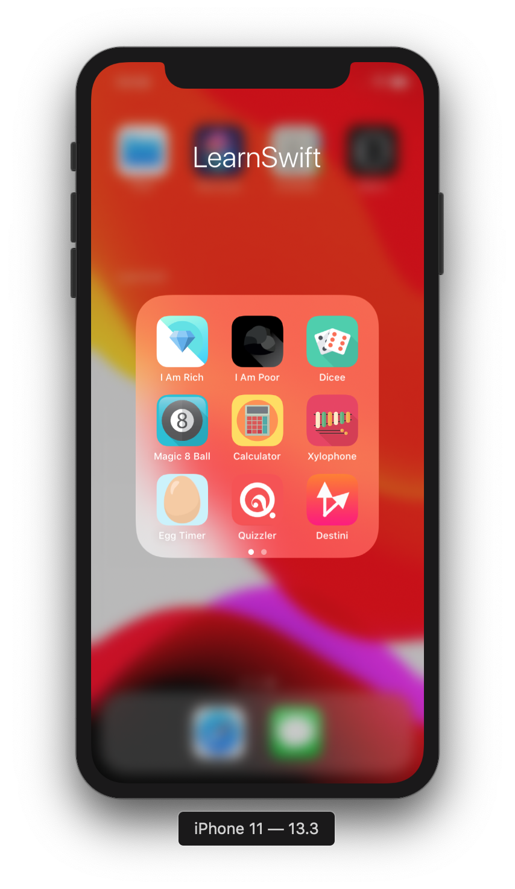

# LearnSwift

## Preview

  

## Projects

- [I Am Rich](https://github.com/Sxy623/LearnSwift/tree/master/I%20Am%20Rich)
  - Xcode
  - Interface builder
  - UI elements
  - iOS simulator
- [I Am Poor](https://github.com/Sxy623/LearnSwift/tree/master/I%20Am%20Poor)
  - Exercise
- [Dicee](https://github.com/Sxy623/LearnSwift/tree/master/Dicee)
  - Swift variables, constants and arrays
  - Swift data type system
  - IBActions and IBOutlets
  - UIButtons
- [Magic 8 Ball](https://github.com/Sxy623/LearnSwift/tree/master/Magic%208%20Ball)
  - Exercise
- [Calculator](https://github.com/Sxy623/LearnSwift/tree/master/Calculator)
  - Auto layout
  - Stack views
- [Xylophone](https://github.com/Sxy623/LearnSwift/tree/master/Xylophone)
  - Swift functions, input parameters and return types
  - Error handling
  - AVFoundation and AVAudioPlayer
- [Egg Timer](https://github.com/Sxy623/LearnSwift/tree/master/Egg%20Timer)
  - Swift optionals
  - Swift IF-ELSE and Switch statements
  - Swift dictionaries
  - UIProgressView
  - Timer
- [Quizzler](https://github.com/Sxy623/LearnSwift/tree/master/Quizzler)
  - Swift structures, properties and methods
  - Model-View-Controller design pattern
  - Immutability
- [Destini](https://github.com/Sxy623/LearnSwift/tree/master/Destini)
  - Exercise
- [BMI Calculator](https://github.com/Sxy623/LearnSwift/tree/master/BMI%20Calculator)
  - Swift classes, object-oriented programming and inheritance
  - UISliders
  - Segues
- [Tipsy](https://github.com/Sxy623/LearnSwift/tree/master/Tipsy)
  - UITextField
  - UIStepper
- [Clima](https://github.com/Sxy623/LearnSwift/tree/master/Clima)
  - Swift closures
  - Swift protocols and extensions
  - Swift computed properties
  - Delegation design pattern
  - Dark mode
  - Networking, APIs and JSON parsing
  - CoreLocation
- [Byte Coin](https://github.com/Sxy623/LearnSwift/tree/master/Byte%20Coin)
  - UIPickerView
- [Flash Chat](https://github.com/Sxy623/LearnSwift/tree/master/Flash%20Chat)
  - Swift loops
  - CocoaPods
  - Swift package manager
  - UITableView
  - Navigation controller
  - Firebase
- [I Am Rich 2](https://github.com/Sxy623/LearnSwift/tree/master/I%20Am%20Rich%202)
  - SwiftUI
- [Coco Card](https://github.com/Sxy623/LearnSwift/tree/master/Coco%20Card)
  - SwiftUI
- [Dicee 2](https://github.com/Sxy623/LearnSwift/tree/master/Dicee%202)
  - SwiftUI
  - `@State` property modifier
- [H4X0R News](https://github.com/Sxy623/LearnSwift/tree/master/H4X0R%20News)
  - SwiftUI
  - List and NavigationView
  - Observer design pattern
  - WebKit
  - Project Catalyst
- [Todoey](https://github.com/Sxy623/LearnSwift/tree/master/Todoey)
  - Local data persistance
  - Core data
  - Realm
- [See Food](https://github.com/Sxy623/LearnSwift/tree/master/See%20Food)
  - CoreML
- [What Flower](https://github.com/Sxy623/LearnSwift/tree/master/What%20Flower)
  - CoreML
- [AR Dicee](https://github.com/Sxy623/LearnSwift/tree/master/AR%20Dicee)
  - ARKit
  - Plane detection
- [AR Ruler](https://github.com/Sxy623/LearnSwift/tree/master/AR%20Ruler)
  - ARKit
- [Poke3D](https://github.com/Sxy623/LearnSwift/tree/master/Poke3D)
  - ARKit 2
  - Image tracking
- [Magic Paper](https://github.com/Sxy623/LearnSwift/tree/master/Magic%20Paper)
  - ARKit 2
  - Live video
